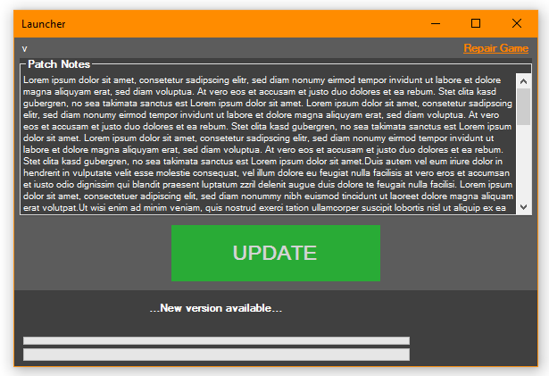

# Simple Patch Tool
**CREATED AND MANAGED BY DHANANJAY SENDAY**

SimplePatchTool is a general-purpose patcher library for **standalone** applications.

## FEATURES

- written completely in **C#**
- supports **repair patching** as well as **binary diff patching**
- gives you complete control over where the patch files are stored (you can even host your files on Google Drive™)
- supports self patching (e.g. launcher patching itself)
- does not request admin permissions unless necessary
- supports encrypting/signing important patch files as an additional layer of security
- compatible with **.NET Standard 2.0** (the *optional* XML signing module requires [additional NuGet package(s)](https://www.nuget.org/packages/System.Security.Cryptography.Xml/)) and **Mono 2.0** (according to official [.NET Portability Analyzer](https://docs.microsoft.com/en-us/dotnet/standard/analyzers/portability-analyzer))

## ROADMAP

- [x] Updated Play And Patch Button
- [ ] Added Login Ui
- [ ] UI enhaced
- [ ] calculate the estimated remaining time
